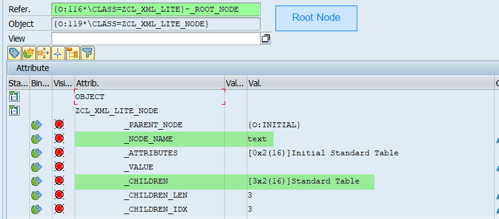
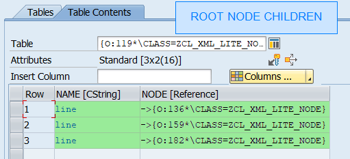
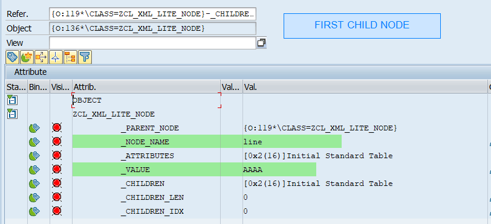

# zcl_xml_lite

A very basic class to handle XML nodes &amp;
attributes in a better way than **ixml** &amp; **sxml**.


## Purpose of the class

For the most basic developments on XML strings, using standard
classes ``cl_ixml`` and `cl_sxml` are difficult  to use and
debug is not possible due to how classes works using only handlers numbers.

For instance, to process a XML string with ``cl_ixml``,
you have to follow these steps :

* Create an new instance of ``cl_ixml``
* Create an new document using ``cl_ixml``
* Create a stream factory
* Parse the XML using instance ``cl_ixml`` with :
    * The document
    * The stream factory
    * And the stream, using stream factory with convertion of the XML in hexadecimal
* Create an interator
* Read node from iterator

With ``zcl_xml_lite``, you have only to instantiate with your XML string,
then loop on children nodes.

This is the goal of this class : allowing most common and basic manipulation
of XML nodes : read, update, create, remove nodes and their attributes, no more, no less.

Below, an example with ``cl_ixml``:

````abap
" Source : https://blogs.sap.com/2013/04/11/abap-and-xml-wrapping-it-up/
DATA xml TYPE xstring.
xml =
cl_abap_codepage=>convert_to(
  `<text>` &&
  `<line>aaaa</line>` &&
  `<line>bbbb</line>` &&
  `<line>cccc</line>` &&
  `</text>` ).

DATA ixml TYPE REF TO if_ixml.
DATA stream_factory TYPE REF TO if_ixml_stream_factory.
DATA document TYPE REF TO if_ixml_document.

ixml = cl_ixml=>create( ).
stream_factory = ixml->create_stream_factory( ).
document = ixml->create_document( ).

IF ixml->create_parser(
  document = document
  stream_factory = stream_factory
  istream = stream_factory->create_istream_xstring( string = xml )
  )->parse( ) <> 0.
  RETURN.
ENDIF.

" Iterate DOM and modify text elements
DATA iterator TYPE REF TO if_ixml_node_iterator.
iterator = document->create_iterator( ).
DATA node TYPE REF TO if_ixml_node.
DO.
  node = iterator->get_next( ).
  IF node IS INITIAL.
    EXIT.
  ENDIF.
  IF node->get_type( ) = if_ixml_node=>co_node_text.
    node->set_value( to_upper( node->get_value( ) ) ).
  ENDIF.
ENDDO.

" Render DOM into xstring
CLEAR xml.
document->render(
  ostream = ixml->create_stream_factory(
  )->create_ostream_xstring(
  string = xml ) ).

cl_abap_browser=>show_xml( xml_xstring = xml ).
````

With ``zcl_xml_lite`` that becomes :

````abap
DATA xml TYPE string.
xml = |<text>|               &&
      |  <line>aaaa</line>|  &&
      |  <line>bbbb</line>|  &&
      |  <line>cccc</line>|  &&
      |</text>|              .

cl_abap_browser=>show_xml( xml ).

DATA lr_xml TYPE REF TO zcl_xml_lite.
lr_xml = NEW zcl_xml_lite( xml ).

DATA lr_root_node TYPE REF TO zcl_xml_lite_node .
lr_root_node = lr_xml->root_node( ).

WHILE lr_root_node->next( ) IS NOT INITIAL.
  lr_root_node->child( )->set_value(
    to_upper( lr_root_node->child( )->get_value( ) )
  ).
ENDWHILE.

cl_abap_browser=>show_xml( lr_xml->stringify( ) ).
````

In debug, it's very easy to browse between nodes :








**If you think ``cl_ixml`` and `cl_sxml` are too difficult to
use and you have only basics modifications to do,
``zcl_xml_lite`` is made for you !**


## Summary

[](BeginSummary)
* [Purpose of the class](#purpose-of-the-class)
* [Summary](#summary)
* [Getting Started](#getting-started)
[](EndSummary)


## Getting Started

